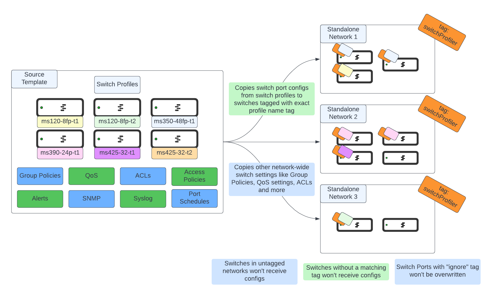
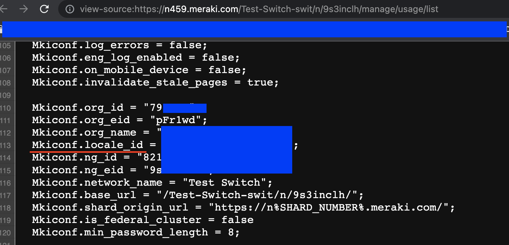
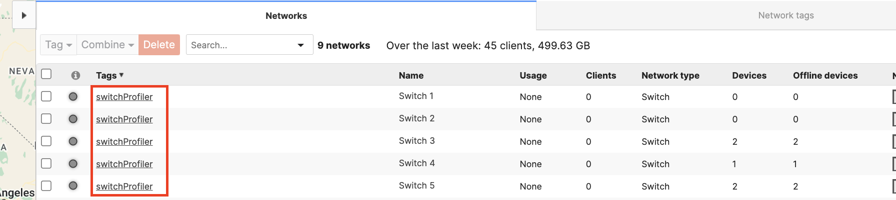
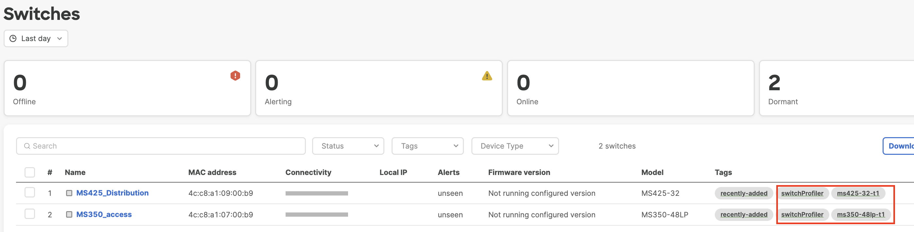
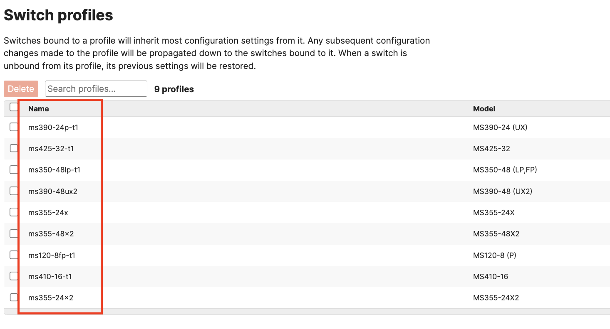
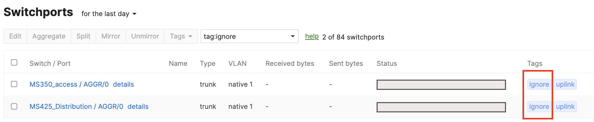

# merakiSwitchProfiler

Copy switchport profiles and settings like QoS, ACLs, SNMP and Syslog from a source template, without having to bind your networks to it, giving you a lot more freedom and control over individual configs and firmware preferences.

# Table of Contents

[Introduction](#intro)

[Prerequisites](#prereq)

[How to use](#howtouse)

[Caveats](#caveats)

# Introduction

Cisco Meraki Configuration Templates and Switch Profiles allow organizations to manage large numbers of switches distributed across many locations in a simplified manner, centralizing configurations in one point. However, they also introduce a number of limitations:
1. All sites bound to the template must conform to a single firmware version, and must be upgraded together
2. It removes the option of using Staged Upgrades, forcing all upgrades within a site to happen concurrently
3. It forces all template-bound networks to conform not only to the same Switch Profiles, but also to the same Group Policies, QoS settings, ACL rules and other network-wide settings
4. It limits local divergences in switch port configurations, as any changes to the switch profiles will be pushed out to all bound switches

This tool allows decoupling of firmware upgrades and network settings from switch port configurations, and offers additional flexibility in deploying port configuration changes, like defining ports to be ignored during configuration pushes, and only pushing changes to a subset of your switches. All of this is achieved via Tags:

* **Network Tags** identify networks the tool will operate on and copy Network-wide configurations to (Group Policies, QoS, ACLs, Alerts, Syslog, SNMP, Traffic Analytics)
* **Switch Tags** identify switches within these networks that will have their ports synced to profiles that carry the same name as the tag (including associated Access Policies and Port Schedules)
* **Ignore Port Tags** identify ports that should not be updated by the script, even if the script is operating on other ports in the same switch. This allows preservation of local overrides and protecting critical ports like uplinks and server ports

The script also has the added flexibility of allowing you to reference a configuration template as a source that resides in a different organization than the one where your switches currently exist on, permitting syncing configurations across organizations. It also allows the definition of a template for switch port profiles, and a separate different template for Network settings, decoupling port-level configurations from ACLs, QoS, Alerting and other settings for added flexibility.

All of this is done without ever binding switches to configuration templates, which allows you to keep completely separate firmware upgrade procedures across networks, and keeping advanced functionalities like Staged Upgrades available.

## Prerequisites

1. Active Cisco Meraki subscriptions in the orgs where the script will be run
2. API access enabled for these organizations, as well as an API Key with access to them. See how to enable [here](https://documentation.meraki.com/General_Administration/Other_Topics/Cisco_Meraki_Dashboard_API)
3. A working Python 3.0 environment
4. Install libraries in `requirements.txt`
5. Create a configuration template for housing your configurations, and optionally a second configuration template if you wish to decouple Group Policies, QoS, ACL, Alert, Syslog, SNMP configurations from the switch profiles template.
6. Set up switch port profiles for each of the types of switches you will deploy in your environment in the source template. You can see how to configure port profiles [here](https://documentation.meraki.com/Architectures_and_Best_Practices/Cisco_Meraki_Best_Practice_Design/Best_Practice_Design_-_MS_Switching/Templates_for_Switching_Best_Practices#Switch_Profiles)
7. Set up [Group Policies](https://documentation.meraki.com/MS/Access_Control/Meraki_MS_Group_Policy_Access_Control_Lists), [QoS](https://documentation.meraki.com/MS/Other_Topics/QoS_(Quality_of_Service)), [ACLs](https://documentation.meraki.com/MS/Layer_3_Switching/Configuring_ACLs), [Alerts](https://documentation.meraki.com/General_Administration/Cross-Platform_Content/Alerts_and_Notifications), [SNMP](https://documentation.meraki.com/General_Administration/Monitoring_and_Reporting/SNMP_Overview_and_Configuration), [Syslog](https://documentation.meraki.com/General_Administration/Monitoring_and_Reporting/Syslog_Server_Overview_and_Configuration), [Access Policies](https://documentation.meraki.com/MS/Access_Control/MS_Switch_Access_Policies_(802.1X)) and [Port Schedules](https://documentation.meraki.com/MS/Access_Control/Port_Schedules) in source templates.
8. Deploy additional standalone networks with switches in them

## How to Use

1. Clone repo to your working directory with `git clone https://github.com/Francisco-1088/merakiSwitchProfiler.git`
2. Edit `config.py`
* Add your API Key under `api_key` in line 2
* Add the Organization ID of the organization where the source configuration template exists. You can find your Org ID easily by right clicking anywhere in the screen while logged in to your organization, and clicking "View Page Source". In the resulting page use "Find" to look for the keyword `Mkiconf.org_id`

* Add the Organization ID of the organization where your target standalone switch networks exist. These networks may be combined networks, and may reside in the same organization as the source template, but don't have to. You can find this organization ID in the same way outlined in the previous step.
* Add the Source Template ID for the configuration template storing all of the switch port profiles created in Prerequisites #5. You can find this ID easily by navigating to your Configuration Template in the Meraki Dashboard, right-clicking anywhere and choosing "View Page Source". In the resulting page use "Find" to look for the keyword `Mkiconf.locale_id`. Copy the number between the quotation marks, and prepend the string `L_` right before it, and add it to the configuration file.

* Add the Source Template ID for the configuration template storing all of the other network configurations defined in Prerequisites #6. This template can be the same as the one that holds the port profiles, but can also be a different one if you want to decouple these pieces of configuration. You can find this ID easily by navigating to your Configuration Template in the Meraki Dashboard, right-clicking anywhere and choosing "View Page Source". In the resulting page use "Find" to look for the keyword `Mkiconf.locale_id`. Copy the number between the quotation marks, and prepend the string `L_` right before it, and add it to the configuration file. For example, if your template's ID is `34567897`, the value you should input in the configuration file is `L_34567897`.
* OPTIONAL: Modify the tag under `dst_network_tag` to a tag of your preference. You may use `switchProfiler` if you want. This tag is used to identify networks that your script will deploy configurations to.
* OPTIONAL: Modify the tag under `dst_switch_tag` to a tag of your preference. You may use `switchProfiler` if you want. This tag is used to identify switches that your script will deploy switch port configurations to.
* OPTIONAL: Modify the tag under `ignore_port_tag` to a tag of your preference. You may use `ignore` if you want. This tag identifies ports within a switch that you DO NOT want to make configuration changes to. The script will not make any changes to these ports even if it's deploying configs to other ports in the switch.
* OPTIONAL: Modify verbosity and logging settings. By default, the script will show you every step it's going through, and will prompt you before making any configuration changes. It is recommended to use it this way while you're testing the script, and for debugging purposes. `verbose` displays additional information about the data gathered from the source networks. `supervised` prompts you before every configuration change, allowing you to skip it. `console_logging` enables API log messages to appear in the console. You may set any of these to `False` if you do not want this level of logging.
3. Run `pip install -r requirements.txt` from your terminal
4. [Tag networks](https://documentation.meraki.com/General_Administration/Organizations_and_Networks/Organization_Menu/Manage_Tags) you want to work on with the same tag you defined in `config.py` under `dst_network_tag`

5. [Tag switches](https://documentation.meraki.com/General_Administration/Organizations_and_Networks/Organization_Menu/Manage_Tags#Creating_Device_tags) you want to copy switch port profiles to with the same tag you defined in `config.py` under `dst_switch_tag`
6. Tag these same switches with one additonal tag that has the exact same name as the switch port profile you want to deploy on this switch from your source template. For example, if you want to copy the switch port configs on a MS410-16 profile named `ms410-16-t1`, you must tag a corresponding MS410-16 switch with the tag `ms410-16-t1`.

The tagged switches in the picture will receive the configurations of the profiles `ms425-32-t1` and `ms350-48lp-t1`, as their tags and models match these profile names. They also carry the `switchProfiler` tag that enables operations on them.

NOTE: Port configs will only be applied to switches that meet the following conditions:
* The network the switch belongs to must have the tag specified in #4
* The switch must have the tag specified in #5
* The switch must have a tag that matches the exact name as a switch port profile in the source template
* The switch's model must match the model specified in the creation of the switch port profile, i.e. you cannot read a profile for an MS390-24UX and apply it to an MS350-48FP
7. OPTIONAL: If there are any switch ports that you want to ignore or not update (for example uplinks), make sure to [tag them](https://documentation.meraki.com/MS/Port_and_VLAN_Configuration/Switch_Ports#Port_configuration) with a switch port tag matching the one you specified in `config.py` under `ignore_port_tag`

8. Run the script with `python main.py`

**Note:** If any of your Access Policies contain RADIUS configurations, you will be prompted to manually enter the RADIUS secret for each of the participating servers, as these cannot be obtained via the API.

**Note:** If using the `supervised=True` configuration in the `config.py` file, every time the script will apply configuration changes it will prompt you to accept whether you want to continue or not. The prompt ONLY accepts `Y` for continuing, or `N` for skipping, and it is cap-sensitive. Any other input will break execution. A `N` will return execution to the script before calling the function with the exception of Access Policies and Port Schedules. If you choose to skip either of these, the script will also break execution, as not creating these will cause problems when attempting to update Switch Port configurations.

## Caveats

1. This script is intended to help managing large amounts of switches with the same automation capabilities of templates with profiles, but without limitations like having to run the same firmware version across all networks using the template, and offering more flexibility in individual switch configurations and stack management
2. The script does not copy any L3 switch configurations, these are meant to be done on a per network basis
3. The script does not copy any STP settings, these are meant to be done on a per switch basis
4. The script does not copy any configurations related to MX appliances or MR access points from the source template, these will be left as is in the destination network
5. Make sure to leverage the `ignore_tag` functionality to tag switchports that you DO NOT want modified by the script. Example ports would be uplink ports or ports connecting to critical equipment.
6. Be advised that changes to switch port configurations may result in STP convergence events, and lead to switch outages, so make sure you know what you're doing and that you're following [STP best practices](https://documentation.meraki.com/MS/Port_and_VLAN_Configuration/Configuring_Spanning_Tree_on_Meraki_Switches_(MS)) at all times, leveraging BPDU Guard on any ports you do not want switches connecting to, Loop Guard and UDLD on any ports susceptible to unidirectional links (like fiber ports), and Root Guard on any ports that should never become root ports. Make sure that ports that should not have anything connected to them remain disabled at all times.
7. Start small, and test the script with a small number of networks and switches, and progressively increase the number of sites until you get a feel for the time it takes for the script to gather data and push configs. Remember the Meraki API has a 10 requests per second per organization limit. Every network you want to push changes to will generate at least 10 GET API calls to gather data about the network, so if you're working on 500 networks this means 5000 API calls, which take at least 8 minutes and 20 seconds to complete, and likely a bit longer, plus the amount of time it will take to push configuration changes which will be longer. As such, it's a good idea to segment your work in groups of networks and not try to get everything done at the same time.
